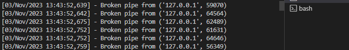

# 08-PJT 정휘원 박은미

## 예상 일정표

|시간|목표|중요도|예상 난이도|
|:---|---------:|:---:|:---:|
|11:00~12:00|수업내용 정리/바로 적용가능한 과제 확인|★★★★| ? |
|13:00~14:00|과제 A, B 해결(은미) / 과제 C 알고리즘 구현(휘원)|★★★|★★★|
|14:00~15:00|구현 된 부분 확인, 상호 코드 리뷰|★★|★★|
|15:00~16:00|과제 D 해결(성능측정)|★★★|★★|
|16:00~16:30|추가 기능 구현 가능성 토의(웹 디스플레이, 성능 측정 버튼 만들기 등)|★|★★★★|
|16:30~17:00|README 작성|★★★★|★|

<div style="text-align: right">중요도</div>


<div style="text-align: right">|아주높음|높음|보통|낮음|</div>
<div style="text-align: right"></div>
<div style="text-align: right">|★★★★|★★★|★★|★|</div>

## 실제 진행상황
 |시간|진행|
 |---|---|
 |11:00~11:30| 휘원 - 과제 구분, 구현 코드 정리|
 |11:30~12:00| 은미 - csv 데이터 파일 읽어오는 코드 작성
 |            |휘원 - 평균치 구하기, 가장 가까운 10명 긁어오기 알고리즘 작성|
 |13:00~13:10| 은미 - 과제 A, B 완성|
 |13:10~13:30| 휘원 - 알고리즘 프로젝트에 적용|
 |13:30~13:47| 은미/휘원 - locust로 정렬 방식 별 데이터 확인|

 ## 느낀점 
 ### 1. problem A
 A : CSV 데이터를 DataFrame 으로 변환 후 반환
 
 주어진 csv를 django로 읽어오도록 구현하는게 목표
 -> pandas와 Numpy 데이터를 참고하여 코드를 구현하였다.
 ```
# Numpy를 활용한 csv file open
# np.loadtxt(구분자 = ',', 데이터 타입: string)

def data(request):
    # 2차원 형태로 출력
    np_arr = np.loadtxt('data/test_data.CSV', delimiter=",", encoding='cp949', dtype=str)       
    # 칼럼명 지정하면서 생성하기
    columns=np_arr[0]
    np_arr = np.delete(np_arr, 0, 0)
    # Pandas의 DataFrame 생성 -. 기본적인 데이터 프레임 생성
    df = pd.DataFrame(np_arr, columns=columns)

    data=df.to_dict('records')

    return JsonResponse({'dat':data})

 ```
=> DataFrame 생성 후 JSON 형태로 응답

 ### 2. problem B
 B : 결측치 처리 후 데이터 반환

 A와 동일하게 Numpy로 데이터를 로드 하였는데 한글로 데이터를 받을 수 없는 오류가 발생하여 Pandas로 데이터를 로드하였다.

pandas와 Numpy 데이터를 참고하여 코드를 구현하였다.
`

 ```
# Pandas로 csv 읽어오기
def null(request):
    df = pd.read_csv('data/test_data_has_null.CSV', encoding='cp949')
    # fillna -> 채우기
    # 비어있는 값을 "null" 문자열로 치환
    df.fillna('NULL',inplace=True)

 ```
 => 비어 있는 값을 "null" 문자로 치환 후 DataFrame 반환


 ### 3. problem D
- Broken pipe from (~~~~~) error 발생
locust로 성능 확인 중, 서버에 요청하는 data 양이 너무 많을 떄 등, 

    

- error 원인
    1. 서버 오버로드: 대상 서버(사용자의 장고 응용 프로그램)는 Locust 테스트에서 생성된 요청 및 연결 수에 압도될 수 있습니다. 서버가 오버로드를 방지하기 위해 연결을 닫아서 "파이프가 끊어졌습니다"라는 오류가 발생할 수 있습니다.

    2. 리소스 제한: Locust를 실행하는 시스템에서 열린 파일 설명자 또는 네트워크 연결과 같은 리소스가 부족할 수 있습니다. 이로 인해 연결이 끊어질 수 있습니다.

    3. 네트워크 문제: 네트워크 문제로 인해 연결이 끊어질 수 있습니다.

- 해결방안

    1. 필요 시 입장 인원 설정 등을 통해 방지한다.

    2. Request 이후 Response 기다리기

    3. Exception 무시하기
    
    4. 중복 요청 막기

## 폐기
 **추가 기능 구현 가능성 토의**

시간이 없어서가 아닌, 추가 구현 할 back-end 기능이 없다.

단순 csv 파일을 dataframe으로 가공하고, 웹에서 확인하지 않고 print, postman 의 pretty 방식으로 확인.

 추후에 frontend 의 기능을 추가하게 된다면, 어떤 기능을 추가할지 대략적으로 얘기를 나눌 순 있을 것 같다.

## 느낀점 

 *휘원*
    
    파트너가 일을 잘할 수 있는 방식을 더 이해해야 한다. 
    생각한 것보다 훨씬 오늘 프로젝트를 빨리 끝내게 됐다. 
    알고리즘이 실제 코딩에 어떤 방식으로 적용될지 조금 감이 잡힌다.

 *은미* 
    
    문제를 해결하기 위한 코드를 구현하기까지 문제를 이해하는데 로딩이 필요하다.. 어려움...

 